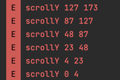

# CafeWithMotionLayout

모션레이아웃 사용해보기


### [Lorem Ipsum](https://www.lipsum.com/)

### [Lorem Picsum](https://picsum.photos/)

- https://picsum.photos/200/300
- assets/home.json

```json
{
  "user": {
    "nickname": "흰둥이",
    "starCount": 10,
    "totalCount": 20
  },
  "appbarImage": "https://picsum.photos/200/300"
}
```

```kotlin
// Util.kt
fun Context.readData(): Home? {
    return try {
        val inputStream = this.resources.assets.open("home.json")

        val buffer = ByteArray(inputStream.available())
        inputStream.read(buffer)
        inputStream.close()

        String(buffer)

        val gson = Gson()
        gson.fromJson(String(buffer), Home::class.java)
    } catch (e: IOException) {
        null
    }
}
```

### [Mocky](https://designer.mocky.io/)

## Scroll

다음 구조로 xml 레이아웃을 구성하였을 때, scroll 변경에 대한 처리는 어떻게 할 것인가?

```xml
<?xml version="1.0" encoding="utf-8"?>
<androidx.coordinatorlayout.widget.CoordinatorLayout
    xmlns:android="http://schemas.android.com/apk/res/android"
    xmlns:app="http://schemas.android.com/apk/res-auto"
    xmlns:tools="http://schemas.android.com/tools" android:id="@+id/coordinatorLayout"
    android:layout_width="match_parent" android:layout_height="match_parent">

    <com.google.android.material.appbar.AppBarLayout android:id="@+id/appBarLayout"
        android:layout_width="match_parent" android:layout_height="wrap_content"
        android:background="@color/white">

        <com.google.android.material.appbar.CollapsingToolbarLayout
            android:id="@+id/collapsingToolbarLayout" android:layout_width="match_parent"
            android:layout_height="wrap_content" app:contentScrim="@color/white"
            app:layout_scrollFlags="scroll|exitUntilCollapsed">

            <androidx.constraintlayout.widget.ConstraintLayout android:layout_width="match_parent"
                android:layout_height="250dp">

                <ImageView android:id="@+id/appBarImageView" android:layout_width="0dp"
                    android:layout_height="170dp" android:alpha="0.45"
                    android:background="@color/material_dynamic_tertiary20"
                    android:contentDescription="@null" android:scaleType="centerCrop"
                    app:layout_constraintEnd_toEndOf="parent"
                    app:layout_constraintStart_toStartOf="parent"
                    app:layout_constraintTop_toTopOf="parent" />

                <TextView android:id="@+id/appBarTitleTextView" android:layout_width="wrap_content"
                    android:layout_height="wrap_content" android:layout_marginStart="20dp"
                    android:layout_marginTop="50dp" android:text="@string/appbar_title_text"
                    android:textColor="@color/black" android:textSize="22sp"
                    android:textStyle="bold" app:layout_constraintStart_toStartOf="parent"
                    app:layout_constraintTop_toTopOf="parent" />

                <ProgressBar android:id="@+id/appbarProgressBar"
                    style="?android:attr/progressBarStyleHorizontal" android:layout_width="0dp"
                    android:layout_height="8dp" android:layout_marginStart="16dp"
                    android:layout_marginEnd="16dp" android:layout_marginBottom="50dp"
                    android:max="12" android:progress="5"
                    android:progressDrawable="@drawable/drawable_progress"
                    app:layout_constraintBottom_toBottomOf="parent"
                    app:layout_constraintEnd_toStartOf="@id/startCountTextView"
                    app:layout_constraintStart_toStartOf="parent"
                    app:layout_constraintTop_toBottomOf="@id/appBarImageView" />

                <TextView android:id="@+id/startCountTextView" android:layout_width="wrap_content"
                    android:layout_height="wrap_content" android:layout_marginEnd="20dp"
                    android:layout_marginBottom="50dp" android:text="@string/appbar_start_title"
                    android:textColor="@color/black" android:textSize="28sp"
                    android:textStyle="bold" app:layout_constraintBottom_toBottomOf="parent"
                    app:layout_constraintEnd_toEndOf="parent"
                    app:layout_constraintTop_toBottomOf="@id/appBarImageView" />
            </androidx.constraintlayout.widget.ConstraintLayout>

            <androidx.appcompat.widget.Toolbar android:layout_width="match_parent"
                android:layout_height="50dp" android:layout_gravity="bottom"
                android:background="@color/white">

                <LinearLayout android:layout_width="match_parent"
                    android:layout_height="match_parent" android:gravity="center_vertical"
                    android:orientation="horizontal">

                    <TextView android:id="@+id/newsTextView" android:layout_width="wrap_content"
                        android:layout_height="wrap_content" android:drawablePadding="2dp"
                        android:text="@string/what_news" android:textColor="@color/black"
                        android:textSize="20sp"
                        app:drawableStartCompat="@drawable/baseline_fiber_new_24" />

                    <TextView android:id="@+id/couponTextView" android:layout_width="wrap_content"
                        android:layout_height="wrap_content" android:layout_marginStart="20dp"
                        android:drawablePadding="2dp" android:text="@string/coupon"
                        android:textColor="@color/black" android:textSize="20sp"
                        app:drawableStartCompat="@drawable/baseline_request_page_24" />
                </LinearLayout>
            </androidx.appcompat.widget.Toolbar>
        </com.google.android.material.appbar.CollapsingToolbarLayout>
    </com.google.android.material.appbar.AppBarLayout>

    <androidx.core.widget.NestedScrollView android:id="@+id/scrollView"
        android:layout_width="match_parent" android:layout_height="wrap_content"
        app:layout_behavior="@string/appbar_scrolling_view_behavior">

        <LinearLayout android:layout_width="match_parent" android:layout_height="wrap_content"
            android:orientation="vertical">

            <include android:id="@+id/recommendMenuList"
                layout="@layout/layout_horizontal_menu_list" />

            <include android:id="@+id/bannerLayout" layout="@layout/layout_banner_image" />

            <include android:id="@+id/foodMenuList" layout="@layout/layout_horizontal_menu_list" />
        </LinearLayout>
    </androidx.core.widget.NestedScrollView>

    <com.google.android.material.floatingactionbutton.ExtendedFloatingActionButton
        android:id="@+id/floatingActionButton" android:layout_width="wrap_content"
        android:layout_height="wrap_content" android:layout_gravity="end|bottom"
        android:layout_margin="20dp" android:backgroundTint="@color/gold"
        android:contentDescription="@null" android:text="@string/delivery"
        android:textColor="@color/black" app:icon="@drawable/baseline_delivery_dining_24"
        app:iconTint="@color/black" />
</androidx.coordinatorlayout.widget.CoordinatorLayout>
```

scroll 값 변경에 대해 알아보기 위해 `NestedScrollView`에 대해 `setOnScrollChangeListener`를 설정하여 scrollY 값의 변화에 대해
로그를
활용하여 알아낼 수 있다.

```kotlin
binding.scrollView.setOnScrollChangeListener { v, _, scrollY, _, oldScrollY ->
    Log.e("ee", "scrollY $scrollY $oldScrollY")
}
```



- 앞의 값이 `scrollY`, 뒤의 값이 `oldScrollY`인데, `oldScrollY`는 스크롤을 하기 전의 값을 의미하며 스크롤이 끝났을 때 시점의 `scroll` 값이
  `scrollY`인 것을 확인할 수 있다.
- 또한, `AppBarLayout`이 완전히 접히기 전의 스크롤의 경우에는 이 `Log.e`가 찍히지 않는 것을 확인할 수 있는데, 이는 `AppBarLayout`이 스크롤되는
  동안에는
  이벤트가 `NestedScrollView`에서 일어나는 것이 아님을 알 수 있다.

```kotlin
binding.scrollView.setOnScrollChangeListener { v, _, scrollY, _, oldScrollY ->
    if (scrollY == 0) {
        binding.floatingActionButton.extend()
    } else {
        binding.floatingActionButton.shrink()
    }
}
```

- 따라서 `scrollY`값이 0일 때 `floatingActionButton`을 확장(`extend()`)하고 0보다 큰 값을 가질 때 수축(`shrink()`)시키는 것으로
  구현하였다.